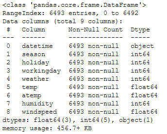
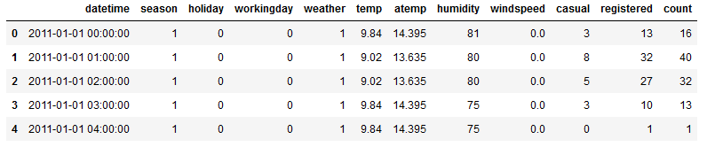
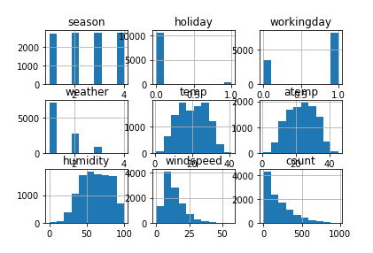
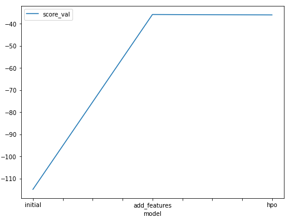
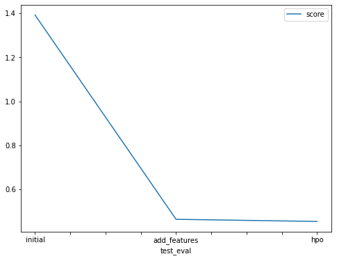

# Report: Predict Bike Sharing Demand with AutoGluon Solution
#### Author: Higor de Faria

## Initial Training
### What did you realize when you tried to submit your predictions? What changes were needed to do to the output of the predictor to submit your results?

Since the competition was asking for a prediction of the number of rentals in a determined period, the minimum possible value for the prediction is 0 (zero), when no rental was made. Therefore, for every prediction smaller than 0 (zero) made by the regressor, it was necessary to interpret it as 0 and change it in the output of the predictor.

### What was the top ranked model that performed?

It was WeightedEnsemble_L3.

## Exploratory data analysis and feature creation
### What did the exploratory analysis find and how did you add additional features?

From the exploratory analysis, some information was obtained:
- Dtypes of the features, showing which features should undergo typecasting, as well as checking for null values:

- The form in which the data was stored in the database, which enabled the planning for detailing of some features (e.g. the breakdown of datetime into hour, day, month, year):

- Feature distribution, showing which ones were continuous and which ones were discrete:

Additional features were added by breaking down the datetime column into hour, day, month and year.
On top of that, the features that were an encoding for categorical features were typecast as "category" instead of "int64".

### How much better did your model preform after adding additional features and why do you think that is?

The root mean squared error for the best regression model evaluated by Autogluon went from 114.93 to 35.83, a 68.8% reduction.

The model performed better because initially the datetime column was not contributing for the regression, since it was a column of strings. Therefore it could not provide any mathematical value for a regression process.
After the datetime column breakdown, the algorithm was able to perceive the new columns as logical features that could be ordered and had mathematical meaning.

## Hyper parameter tuning
### How much better did your model preform after trying different hyper parameters?

The root mean squared error for the best regression model evaluated by Autogluon went from 35.83 to 35.82, an indignificant reduction.

It is important to mention that this reduction could be bigger after many rounds of hyperparameter optimization, given that these results were the initial ones obtained after just a few attempts.

### If you were given more time with this dataset, where do you think you would spend more time?

Given that I am employing an AutoML algorithm, I would spend the majority of my time doing deeper data wrangling, feature engineering and performing more attemps of higher level hyperparameter optimization (instead of trying to tune the hyperparameters of the individual methods used by Autogluon).

### Create a table with the models you ran, the hyperparameters modified, and the kaggle score.

|model|time_limit|num_stack_levels|num_bag_folds|score|
|--|--|--|--|--|
|initial|600|NaN|10|1.39177|
|add_features|600|NaN|10|0.46365|
|hpo|1200|3|5|0.45393|

### Create a line plot showing the top model score for the three (or more) training runs during the project.

### Create a line plot showing the top kaggle score for the three (or more) prediction submissions during the project.

TODO: Replace the image below with your own.

## Summary

During this first assingment I was able to:
- Load and explore data, getting familiarized with data wrangling techniques and best practices;
- Observe the evolution of a machine learning model as the input data was being transformed and becoming more organized and friendly to the regression algorithms;
- Gain insight on the importance of feature engineering and exploratory data analysis on the outcome for prediction models;
- Create visual representations for the data distribution and the results obtained throughout the process;
- Learn a bit more about Autogluon and how to work with it.
